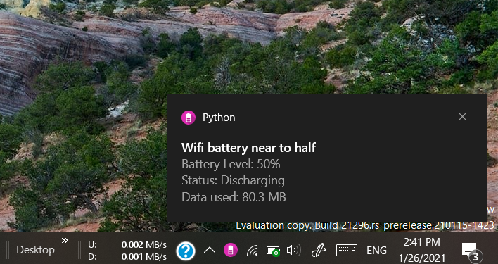
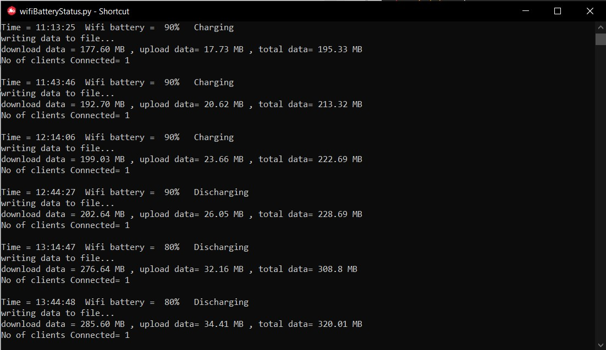
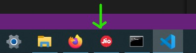

# jioFi-wifi-battery-notifier-and-tracker

A simple python program to notify the battery left and status of JioFi battery

` Add the shortcut of this file in the folder to auto start on windows startup:`

##### ` C:\Users\admin\AppData\Roaming\Microsoft\Windows\Start Menu\Programs\Startup`

`To change the icon of the shortcut to be visible when it runs in taskbar do the following:`

   - you need to get to the file where ever it is right-click it and go to create a shortcut

   - then drag that shortcut to your desktop

   - then right-click that shortcut and click properties

   - then click on "Change Icon"

   - then go to where your desire .ico image is saved and set that as the icon

#### `Word of caution:` Works only with jioFi.

 

 `Jiofi Logs:`
 

 `Jiofi in the taskbar:`

